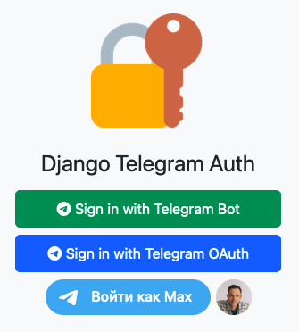

<div align="center">
  
</div>

# Django Telegram Auth

**django-tg-auth** is a simple [Django](https://www.djangoproject.com/) application created using [Django Allauth](https://allauth.org/) and [python-telegram-bot](https://python-telegram-bot.org/) in order to authorize users using a telegram account.

You can see demo of application at [this page](demo/demo.md).

## Requirements

- [Python 3.12](https://www.python.org/) 
- [Django 5.0.3](https://www.djangoproject.com/)
- [python-telegram-bot 21.8](https://github.com/python-telegram-bot/python-telegram-bot)
- [Django Allauth 0.61.1](https://allauth.org/)
- [django-csp 3.8](https://github.com/mozilla/django-csp)
- [python-dotenv 1.0.1](https://github.com/theskumar/python-dotenv)
- [Bootstrap 5.3.3](https://getbootstrap.com)
- [Twitter Twemoji](https://github.com/twitter/twemoji)

Optional (for development):
- Style checking
  - [Flake8 7.0.0](https://pypi.org/project/flake8/)
  - [flake8-print 5.0.0](https://github.com/JBKahn/flake8-print)
- Type checking
  - [Mypy 1.9.0](https://github.com/python/mypy)
  - [mypy-extensions 1.0.0](https://github.com/python/mypy_extensions)
  - [django-stubs 4.2.7](https://github.com/typeddjango/django-stubs)
- Import sorting
  - [Isort 5.13.2](https://github.com/pycqa/isort)

## Installation

To install **django-tg-auth**, you need to run the following steps:

### 1. Download the application's source code 

```sh
$ git clone https://github.com/mmmylnikov/django-tg-auth.git
```

### 2. Go to the application's directory

```sh
$ cd django-tg-auth/
```

### 3. Make a Python virtual environment and activate it

```sh
$ python -m venv .venv
$ source .venv/bin/activate
```

### 4. Install the dependencies

```sh
$ python -m pip install -r requirements.txt
```

### 5. Move to the application's directory

```sh
$ cd django-tg-auth/
```

### 6. Run migrations

```sh
$ python manage.py migrate
```

### 7. Collect static files

```sh
$ python manage.py collectstatic
```

### 8. Make `.env` file and configure it

```sh
$ touch .env
$ nano .env
```

Default `.env` file content:

```
DEBUG=                     # True or False
DJANGO_SECRET_KEY=         # Your secret key
DJANGO_ALLOWED_HOSTS=      # A comma-separated list of allowed hosts
DJANGO_HOST=               # Your application host with protocol

DJANGO_TELEGRAM_USERNAME=  # Telegram bot username from https://t.me/BotFather
DJANGO_TELEGRAM_UID=       # Integer Telegram bot ID
DJANGO_TELEGRAM_SECRET=    # Bot secret key from https://t.me/BotFather

# CSP headers default values.
# For development you can set also "unsafe-inline" and "unsafe-eval" values.
CSP_DEFAULT_SRC=self,https://t.me,https://*.cdn-telegram.org
CSP_SCRIPT_SRC=self,https://cdn.jsdelivr.net,https://telegram.org
CSP_STYLE_SRC=self,https://cdn.jsdelivr.net
CSP_FONT_SRC=self,https://cdn.jsdelivr.net
CSP_FRAME_ANCESTORS=self,https://oauth.telegram.org
CSP_FRAME_SRC=self,https://oauth.telegram.org

LANGUAGE_CODE=             # eg en-us 
TIME_ZONE=                 # eg UTC
```

### 9. Telegram bot configuration

Use [BotFather](https://t.me/BotFather) to create a new bot. After that, you need to set the following parameters in the `.env` file:
- `DJANGO_TELEGRAM_USERNAME`
- `DJANGO_TELEGRAM_SECRET` (bot token)
- `DJANGO_TELEGRAM_UID` (you can get it from https://api.telegram.org/bot<your_bot_token>/getMe)


## Usage

For starting the application and Telegram bot you neded two terminal windows:
- one for application server
- one for Telegram bot


For running the application you need to run the following command:

### 1. To go to the application's directory

```sh
$ cd django-tg-auth/django_tg_auth/
```

### 2. Start application server

```sh
sudo gunicorn --bind <host>:<port> config.wsgi:application
```

### 3. Start Telegram bot

Open **new terminal** and run the following command:

```sh
$ cd django-tg-auth/django_tg_auth
$ python tgbot.py
```

### 4. Open your browser and go to http://host:port

You can log in to the service using the following services: 
1) Telegram Bot (by [python-telegram-bot](https://github.com/python-telegram-bot/python-telegram-bot))
2) Telegram OAuth (by [Allauth](https://docs.allauth.org/en/latest/socialaccount/providers/telegram.html))  
3) Telegram Login Widget (by [Telegram Core](https://core.telegram.org/widgets/login)).

### 5. Stop application server and Telegram bot

For stop Application server press `Ctrl+C` in first terminal and for stop Telegram bot press `Ctrl+C` again.


## Development

To develop **django-tg-auth**, you need to run the following steps:

1. Download the application's source code to a `rptodo_project/` directory

```sh
$ git clone https://github.com/mmmylnikov/books-cli.git
```

2. Create a Python virtual environment and activate it

```sh
$ cd django-tg-auth/
$ python -m venv .venv
$ source .venv/bin/activate
(.venv) $
```

3. Install the dependencies

```sh
(.venv) $ python -m pip install -r requirements_dev.txt
```

4. Make your changes

5. Check style and types

Flake8 and Mypy are used to check the code's style and types. At the same time, imports are sorted using isort.

```sh
$ make check
```

## Release History

- 1.0.0
  + Telegram bot implementation for authorization
  + Django auth application implementation for 3 providers: 
    - Telegram Bot
    - Telegram OAuth
    - Telegram Login Widget
  + Views and Templates for authorization and profile pages
  + Custom user model
  + Checking correctness of hash for authorization and creation user
  + flake8 check code style
  + mypy check types

## TODO

It is necessary to develop a Django project with authorization through a Telegram bot. 

### Implementation requirements:

- [+] Create a web page with the "Log in via Telegram" button
- [+] When you click on the button, you are redirected to the Telegram bot, where the link contains the /start command with a unique token
- [+] After sending a command by the user, Django receives a token and connects the Telegram account with the user of the website
- [+] The web page is automatically updated, displaying the user's name or nickname from Telegram. The user logs in through the standard Django mechanisms.

Minor modifications of the solution are allowed while maintaining the basic functionality.

## About the Author

Max Mylnikov - Telegram: [@mmmylnikov](https://t.me/mmmylnikov)

## License

**django-tg-auth** is distributed under the [MIT License](LICENSE).


