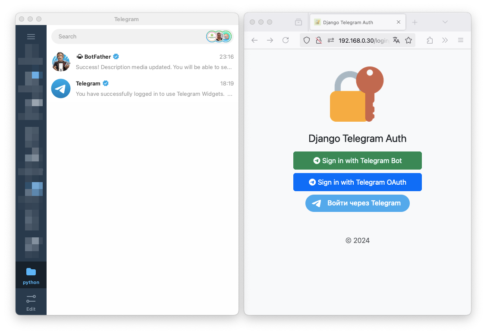
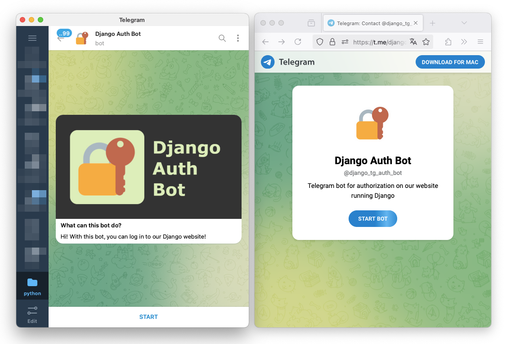

# Demo of Django Telegram Auth

First, open the app in a browser. Also open your Telegram client application.

Now, you can log in using your Telegram account.

## Auth via Telegram Bot

Click the "Sign in with Telegram bot" button.

You will be redirected to the Telegram bot. Click "Start".

Bot send you message with an authorization link. Click "Continue here" button.

After authorization, you will be redirected to your profile page in the app. The user's first and last name and username will be taken from your Telegram account. An additional photo will also be displayed if you also authorize in an alternative way (via a widget, for example).

To exit the profile, press the button "Logout".

## Auth via Telegram OAuth

Click the "Sign in with Telegram OAuth" button.

You will be redirected to the page for entering your Telagram phone number.

After entering the number, you will be sent a confirmation code from the official Telegram [notification account](https://t.me/TelegramSupport).

Click “Confirm” to allow authorization. You will be redirected to your profile page in the app. Name, username and photo will be taken from your Telegram account

To exit the profile, press the button "Logout".

## Auth via Telegram Widget

Click the "Войти через Telegram" button.

You will see a pop-up window confirming your Telegram phone number

After entering the number, you will be sent a confirmation code from the official Telegram [notification account](https://t.me/TelegramSupport).

Click “Confirm” to allow authorization. You will be redirected to your profile page in the app. Name, username and photo will be taken from your Telegram account

Until the browser session is completed, you can log in without Telegram confirmation. In this case, you will see your avatar on the widget.

To exit the profile, press the button "Logout".

You can also read the complete installation and configuration guide in the [README](../README.md).